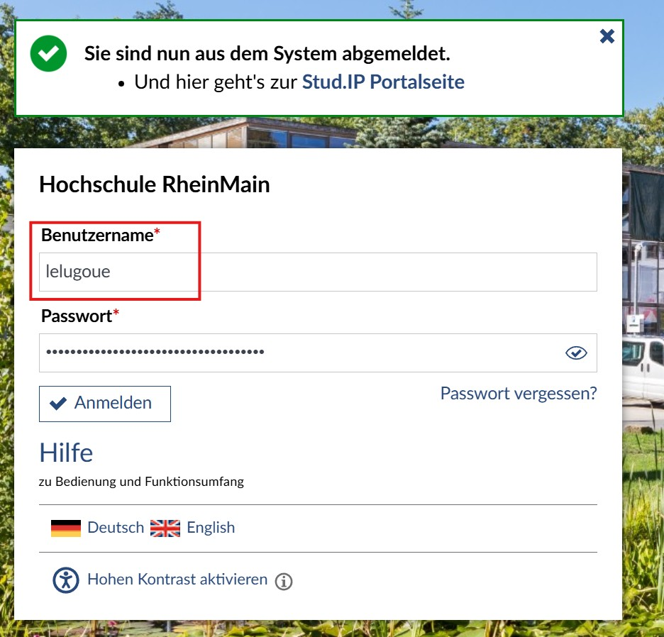
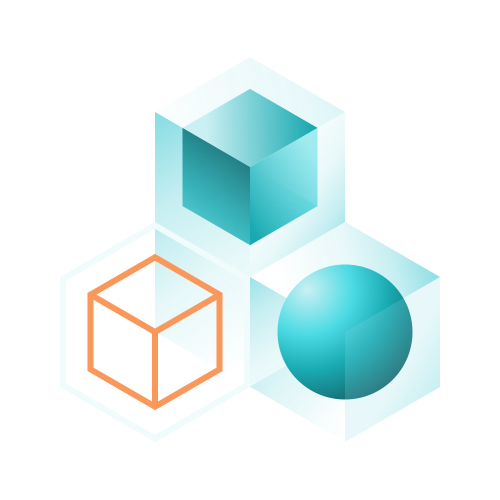
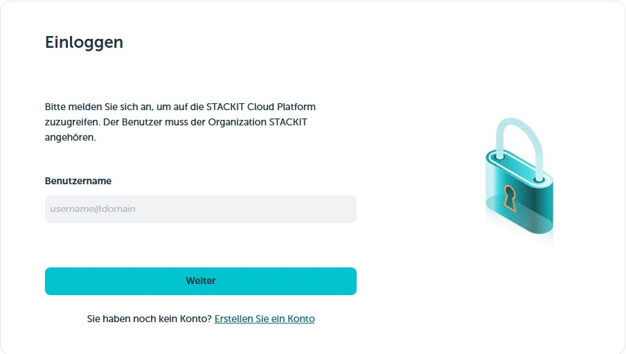
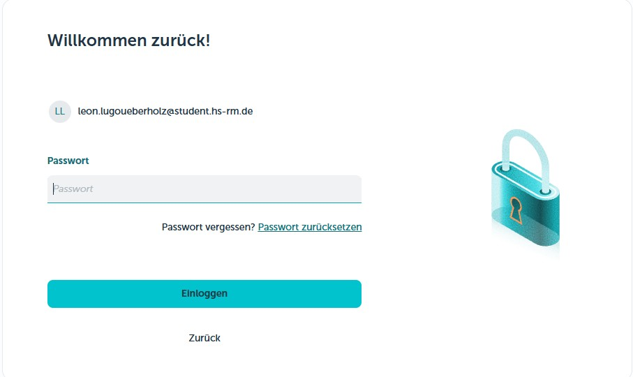
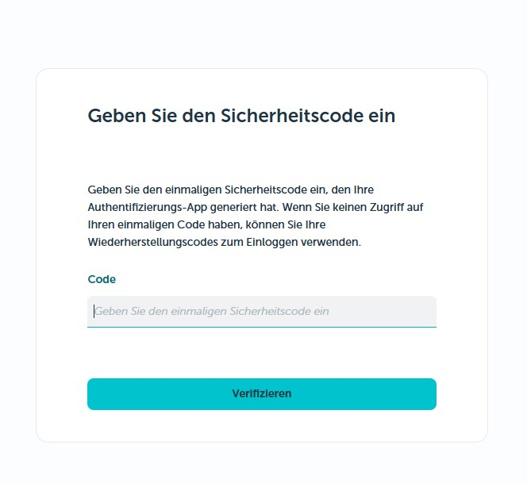
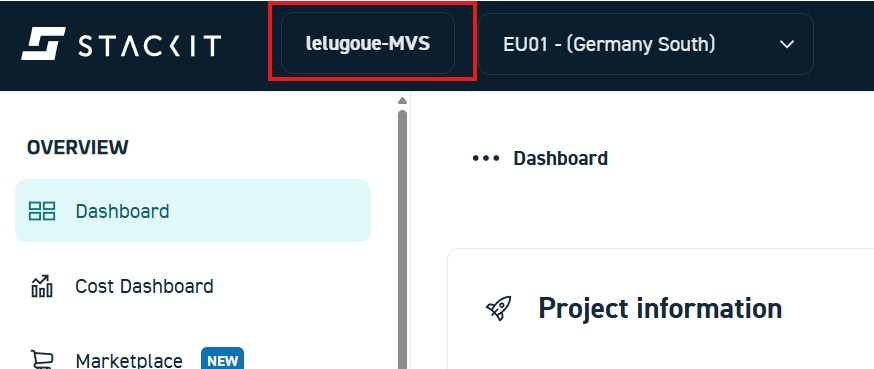

# Einführung

In diesem Versuch werden zunächst die grundlegenden Begriffe und Konzepte eines cloudbasierten Transcodierungs-Workflows erläutert. Anschließend wird anhand einer Schritt-für-Schritt-Anleitung ein erster Transcodierauftrag erstellt und ausgeführt. Ziel ist es, nach Abschluss von Versuch 1 ein grundlegendes Verständnis für Cloud-Transcoder zu entwickeln und einen einfachen Video-on-Demand-Workflow in einer europäischen Cloud-Umgebung selbstständig umsetzen zu können.

Der Versuch basiert auf der Cloud-Plattform STACKIT als Infrastruktur-Anbieter sowie dem Content Delivery Network Fastly zur Auslieferung der Medieninhalte.

## Grundbegriffe

### HDS-Nutzername

Für alle im Rahmen dieses Praktikums durchgeführten Versuche wird ein einheitlicher HDS-Name verwendet. Dieser Name dient der eindeutigen Identifikation von Ressourcen und wird unter anderem bei der Benennung von Buckets, Services und weiteren Komponenten eingesetzt.

Die Syntax des HDS-Namens entspricht derjenigen, die auch bei der Anmeldung im Stud.IP-System verwendet wird. Dadurch ist eine konsistente und nachvollziehbare Zuordnung der angelegten Ressourcen zu einzelnen Studierenden gewährleistet.

Der HDS-Name wird im Verlauf der Versuche mehrfach verwendet und ist daher als fester Bestandteil der jeweiligen Konfigurationen zu verstehen. Änderungen des Namens während des Praktikums sind zu vermeiden, da dies die Zuordnung und Reproduzierbarkeit der Ergebnisse beeinträchtigen kann.

### Cloud-Speicher (*Object-Storage*)

Cloud-Speicher funktioniert im Grundprinzip ähnlich wie bekannte Dienste wie Dropbox oder Google Drive: Dateien werden zentral gespeichert und können bei Bedarf wieder abgerufen werden. In professionellen Cloud-Umgebungen kommt dafür jedoch meist Objektspeicher (Object Storage) zum Einsatz.

Im Gegensatz zu klassischen Ordnerstrukturen werden die Daten hier als einzelne Objekte gespeichert. Jedes Objekt liegt in einem sogenannten Bucket und besitzt eine eindeutige Kennung. Die interne Organisation übernimmt der Cloud-Anbieter, sodass sich Anwender nicht um Verzeichnisstrukturen kümmern müssen.

Für diesen Praktikumsversuch wird STACKIT Object Storage verwendet. Über die Weboberfläche des STACKIT Control Centers oder über standardisierte Schnittstellen (S3-kompatible API) können Dateien hochgeladen und verwaltet werden. In diesem Versuch dient der Objektspeicher als Ablageort für die hochgeladenen Videodateien sowie für die später erzeugten, transcodierten Versionen.

⚠️ Achtung – Kosten
Für gespeicherte Daten fallen laufende Kosten an, außerdem können Kosten für den Datenabruf entstehen. Bei den im Rahmen dieses Versuchs verwendeten kleinen Datenmengen sind diese Kosten sehr gering. Bei größeren Projekten mit vielen oder sehr großen Dateien können die Speicher- und Übertragungskosten jedoch deutlich steigen.
### Transcodierer (*über Virtual-Machine*)

STACKIT stellt keinen eigenen, spezialisierten Transcoding-Dienst bereit. Stattdessen erfolgt die Verarbeitung von Medieninhalten über virtuelle Maschinen, die mit dem Produkt STACKIT Compute Engine bereitgestellt werden. Eine virtuelle Maschine kann dabei wie ein normaler Server betrachtet werden, auf dem eigene Software ausgeführt wird.

In diesem Praktikumsversuch wird auf einer solchen virtuellen Maschine eine Transcoding-Software (z. B. FFmpeg) installiert. Die VM greift zunächst auf die im STACKIT Object Storage abgelegten Videodateien zu und lädt diese zur Verarbeitung herunter. Anschließend werden die Videodateien in verschiedene Zielformate und Auflösungen umgewandelt, um eine spätere Wiedergabe auf unterschiedlichen Endgeräten zu ermöglichen.

Nach Abschluss der Transcodierung werden die erzeugten Ausgabedateien wieder im Object Storage gespeichert. Von dort aus können sie in einem weiteren Schritt über ein Content Delivery Network (CDN) an die Endnutzer ausgeliefert werden. Die virtuelle Maschine übernimmt somit ausschließlich die Aufgabe der Medienverarbeitung und ist nicht direkt an der Auslieferung beteiligt.

Dieses Vorgehen entspricht einem typischen cloudbasierten Video-on-Demand-Workflow und verdeutlicht, wie Rechenressourcen, Speicher und Auslieferung in der Cloud getrennt voneinander eingesetzt werden.

### Log-in

Für diesen Praktikumsversuch erhalten die Studierenden die benötigten Zugangsdaten (Credentials) direkt vom Dozenten. Eine eigene Registrierung ist nicht erforderlich.

Zur Anmeldung auf StackIT gelangt man über diesen Link: https://portal.stackit.cloud/

**Hier kann der bereitgestellte Username aus der E-Mail entnommen werden**

**Hier kann das bereitgestellte Password aus der E-Mail entnommen werden**

**Hier besteht die Möglichkeit eine 2 Faktor Authentifizierung einzugeben. Dies kann wahlweise mit der Uni-Mail oder mit einer App erfolgen. Als App für das Handy empfiehlt sich hier Microsoft Authenticator https://support.microsoft.com/de-de/account-billing/microsoft-authenticator-herunterladen-351498fc-850a-45da-b7b6-27e523b8702a**

**Auf der Landingpage sollte in der oberen Leiste das richtige Projekt und die region EU01 - (Deutschland Süd) ausgewählt werden. Hierfür sollte für Sie bereits ein Projekt vorhanden sein, welches Ihren HDS-Namen beinhaltet**

