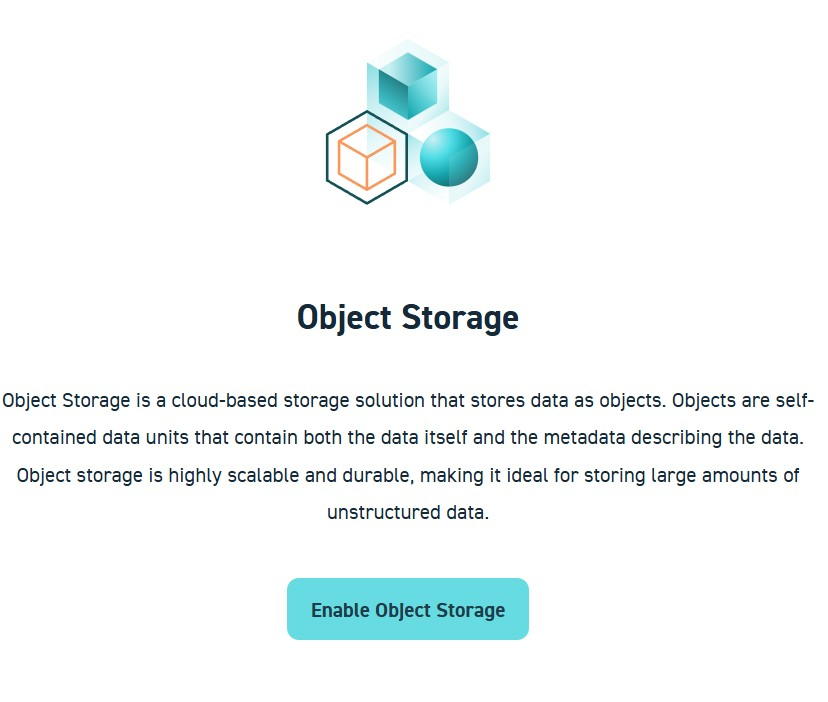
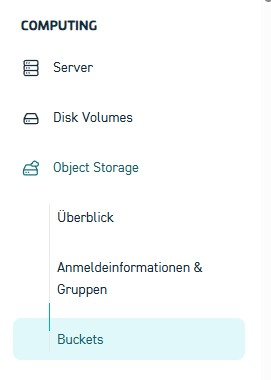
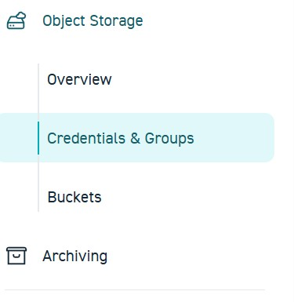
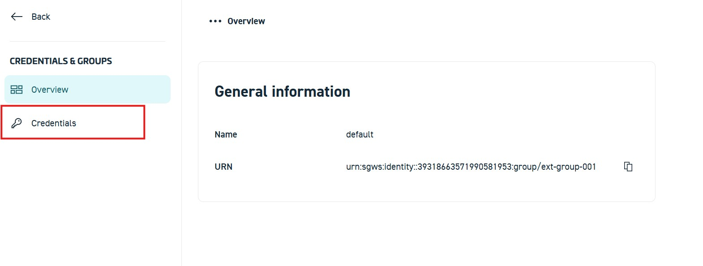

# STACKIT Object Storage

Zuerst wird der Speicherort für die transcodierten Dateien angelegt.  
Dazu wird der **STACKIT Object Storage** verwendet, ein S3-kompatibler Objektspeicher.

**Der Zugriff erfolgt über das **STACKIT Portal** im Browser. Auf der rechten Reiterseite. Hier findet man unter dem Reiter Computing den Unterpunkt "Object storage"**



**Hier muss der Objektspeicher manuell aktiviert werden. Hierfür muss nur der vorhandene Button "Objektspeicher aktivieren" geklickt werden.**

**Nun bitte zu dem Unterreiter Buckets navigieren**


**


<!-- Bild: STACKIT Portal – Projektübersicht mit hervorgehobener Object-Storage-Kachel -->
<div style="
  border: 2px solid #ffffff;
  padding: 14px;
  border-radius: 6px;
  margin: 14px 0;
">
  <span style="color:cyan; font-weight:bold; font-size:1.2em;">
    Frage 1:
  </span><br>
  Was ist ein Bucket im Object Storage?<br>
  Erläutern Sie, welche Aufgabe ein Bucket erfüllt. Erstellen Sie hierfür eine erklärende Skizze und fügen Sie diese in Ihre Abgabemappe hinzu.
</div>

**Klicken Sie auf das Feld "+ Bucket erstellen"**


**Die Namensvergabe soll nach einem einhitlichen Standard erfolgen:  <span style="color:orange; font-weight:bold; font-size:1.2em;">[HDSNAME-Letzten 4 Ziffern Ihrer Matrikelnummer]. Beispiel: [lelugoue-4567]**  </span><br>


<div style="
  border: 2px solid #ffffff;
  padding: 14px;
  border-radius: 6px;
  margin: 14px 0;
">

    ℹ️ Hinweis:
  
  Notieren Sie sich alle im Projekt verwendeten <strong>Zugangsdaten</strong>, 
  <strong>Namen</strong> und <strong>Bezeichnungen</strong> (z. B. Bucket-Namen, 
  Benutzernamen oder Projektkennungen).  
  Diese Informationen werden benötigt, um den Versuch später auch 
  <strong>außerhalb der Präsenzveranstaltung</strong> (z. B. von zu Hause aus) 
  weiterzuführen.
</div>

**Die Oberfläche sollte bei erfolgreicher durchführung wie folgt aussehen:**

## Vorbereitung: Zugangsdaten (Keys) im STACKIT Control Center erstellen

Bevor Dateien hochgeladen werden können, müssen **Zugangsdaten (Keys)** für den Object Storage angelegt werden.  
Diese werden später in der Kommandozeile verwendet.

# 1. Zugangsdaten im STACKIT Portal erstellen


1. Navigieren Sie zu: Object Storage → Credentials & Groups



2.In der Übersicht werden die vorhandenen Credential Groups angezeigt. Standardmäßig existiert bereits eine Gruppe mit dem Namen default.

3. Öffnen Sie die Gruppe default, indem Sie diese anklicken.

4. Wechseln Sie innerhalb der Gruppe in den Reiter Credentials.




5. Klicken Sie auf Create Credentials und erstellen Sie neue Zugangsdaten.


Nach dem Erstellen werden **zwei Schlüssel angezeigt**:
- **Access Key** (öffentlicher Schlüssel)
- **Secret Key** (privater Schlüssel)

⚠️ **Wichtig:**  
Der **Secret Key wird nur einmal angezeigt**.  
Notieren oder speichern Sie beide Keys sorgfältig. Diese werden gleich noch **sehr relevant** sein.

## Upload von Dateien in den STACKIT Object Storage (CLI)

Da der Upload von Dateien **nicht über die Weboberfläche** erfolgt, wird in diesem Versuch ein Kommandozeilen-Werkzeug verwendet.


### Voraussetzungen für den Upload

Für den Upload wird die **AWS CLI** benötigt.

- Download: https://aws.amazon.com/cli/
- Installation mit **Standard-Einstellungen** durchführen
- Nach der Installation ein **neues Terminal / Eingabeaufforderung** öffnen

**Im Terminal folgenden Befehl ausführen:**

```bash
aws configure 
```

**Geben Sie die Werte wie folgt ein:**

```bash
AWS Access Key ID     → eigener Access Key
AWS Secret Access Key → eigener Secret Key
Default region name   → eu01
Default output format → json
```
## Upload des Videos in den Bucket

 Laden Sie das bereitgestellte **testvideo.mp4** aus der E-Mail XYZ herunter.

Geben Sie in der Console nun folegenden Befehl ein 

```bash
aws s3 cp "PFAD_ZUR_DATEI" s3://IhrBucketnamen/ --endpoint-url https://object.storage.eu01.onstackit.cloud

```
**Auf der Weboberfläche unter dem dem Reiter Bucket wird diese Datei nicht angezeigt!**

<div style="
  border: 2px solid #ffffff;
  padding: 14px;
  border-radius: 6px;
  margin: 14px 0;
">
  <span style="color:cyan; font-weight:bold; font-size:1.2em;">
    Frage 2:
  </span><br>
  Wie können Sie nun herausfinden ob der Upload wie geplant funktioniert hat? Recherchieren Sie nach dem benötigten Command und tragen Sie diesen in ihre Abgabemappe ein<br>
</div>


