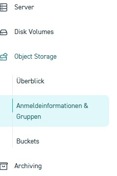
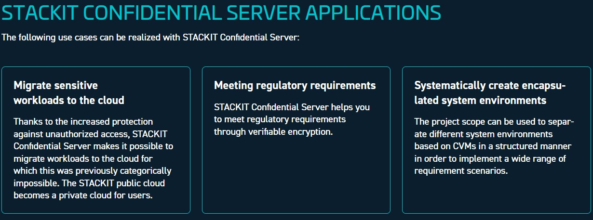
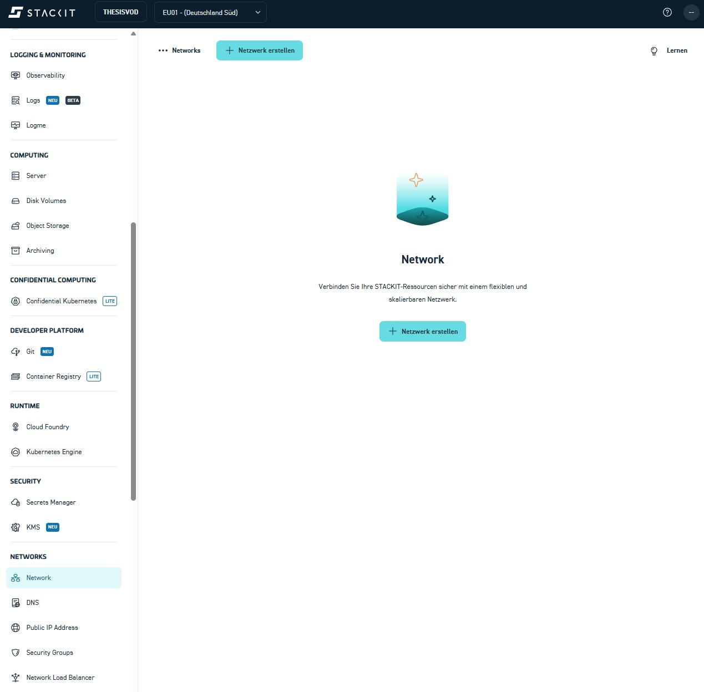
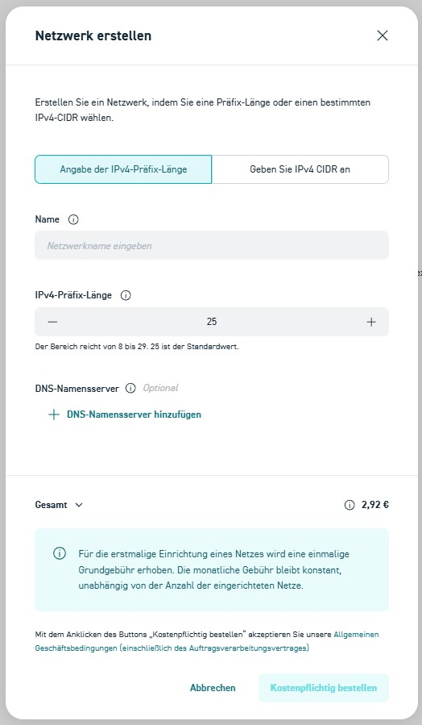
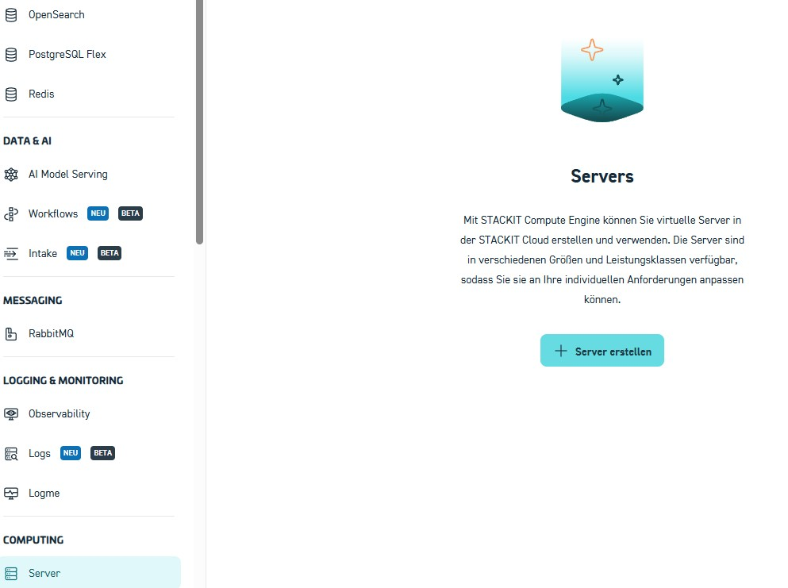
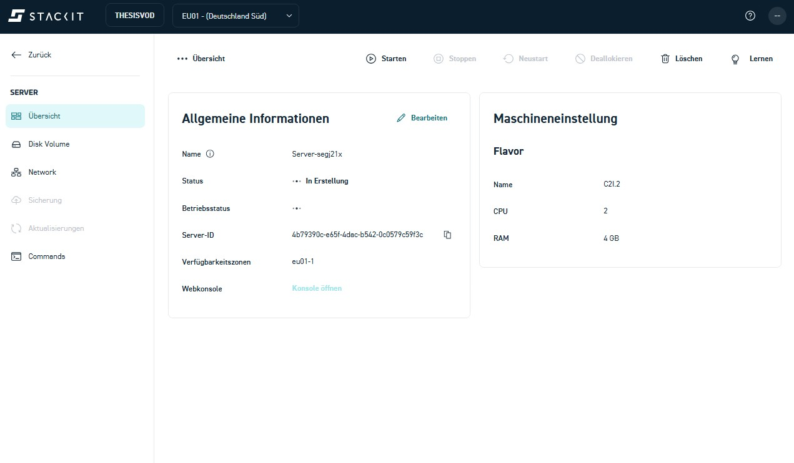

# STACKIT Object Storage

Zuerst wird der Speicherort für die transcodierten Dateien angelegt.  
Dazu wird der **STACKIT Object Storage** verwendet, ein S3-kompatibler Objektspeicher.

**Der Zugriff erfolgt über das **STACKIT Portal** im Browser. Auf der rechten Reiterseite. Hier findet man unter dem Reiter Computing den Unterpunkt "Object storage"**


**Hier muss der Objektspeicher manuell aktiviert werden. Hierfür muss nur der vorhandene Button "Objektspeicher aktivieren" geklickt werden.**

**Nun bitte zu dem Unterreiter Buckets navigieren**


**


<!-- Bild: STACKIT Portal – Projektübersicht mit hervorgehobener Object-Storage-Kachel -->
<div style="
  border: 2px solid #ffffff;
  padding: 14px;
  border-radius: 6px;
  margin: 14px 0;
">
  <span style="color:cyan; font-weight:bold; font-size:1.2em;">
    Frage 1:
  </span><br>
  Was ist ein Bucket im Object Storage?<br>
  Erläutern Sie, welche Aufgabe ein Bucket erfüllt. Erstellen Sie hierfür eine erklärende Skizze und fügen Sie diese in Ihre Abgabemappe hinzu.
</div>

**Klicken Sie auf das Feld "+ Bucket erstellen"**


**Die Namensvergabe soll nach einem einhitlichen Standard erfolgen:  <span style="color:orange; font-weight:bold; font-size:1.2em;">[HDSNAME-Letzten 4 Ziffern Ihrer Matrikelnummer]. Beispiel: [lelugoue-4567]**  </span><br>


<div style="
  border: 2px solid #ffffff;
  padding: 14px;
  border-radius: 6px;
  margin: 14px 0;
">

    ℹ️ Hinweis:
  
  Notieren Sie sich alle im Projekt verwendeten <strong>Zugangsdaten</strong>, 
  <strong>Namen</strong> und <strong>Bezeichnungen</strong> (z. B. Bucket-Namen, 
  Benutzernamen oder Projektkennungen).  
  Diese Informationen werden benötigt, um den Versuch später auch 
  <strong>außerhalb der Präsenzveranstaltung</strong> (z. B. von zu Hause aus) 
  weiterzuführen.
</div>

**Die Oberfläche sollte bei erfolgreicher durchführung wie folgt aussehen:**

## Vorbereitung: Zugangsdaten (Keys) im STACKIT Control Center erstellen

Bevor Dateien hochgeladen werden können, müssen **Zugangsdaten (Keys)** für den Object Storage angelegt werden.  
Diese werden später in der Kommandozeile verwendet.

# 1. Zugangsdaten im STACKIT Portal erstellen


1. Navigieren Sie zu:  
   **Object Storage → Anmeldeinformationen & Gruppen**




2. Klicken Sie auf **„Anmeldeinformationen erstellen“**


3. Bestätigen Sie die Erstellung.
 

Nach dem Erstellen werden **zwei Schlüssel angezeigt**:
- **Access Key** (öffentlicher Schlüssel)
- **Secret Key** (privater Schlüssel)

⚠️ **Wichtig:**  
Der **Secret Key wird nur einmal angezeigt**.  
Notieren oder speichern Sie beide Keys sorgfältig. Diese werden gleich noch **sehr relevant** sein.

## Upload von Dateien in den STACKIT Object Storage (CLI)

Da der Upload von Dateien **nicht über die Weboberfläche** erfolgt, wird in diesem Versuch ein Kommandozeilen-Werkzeug verwendet.


### Voraussetzungen für den Upload

Für den Upload wird die **AWS CLI** benötigt.

- Download: https://aws.amazon.com/cli/
- Installation mit **Standard-Einstellungen** durchführen
- Nach der Installation ein **neues Terminal / Eingabeaufforderung** öffnen

**Im Terminal folgenden Befehl ausführen:**

```bash
aws configure 
```

**Geben Sie die Werte wie folgt ein:**

```bash
AWS Access Key ID     → eigener Access Key
AWS Secret Access Key → eigener Secret Key
Default region name   → eu01
Default output format → json
```
## Upload des Videos in den Bucket

 Laden Sie das bereitgestellte **testvideo.mp4** aus der E-Mail XYZ herunter.

Geben Sie in der Console nun folegenden Befehl ein 

```bash
aws s3 cp "PFAD_ZUR_DATEI" s3://IhrBucketnamen/ --endpoint-url https://object.storage.eu01.onstackit.cloud

```
**Auf der Weboberfläche unter dem dem Reiter Bucket wird diese Datei nicht angezeigt!**

<div style="
  border: 2px solid #ffffff;
  padding: 14px;
  border-radius: 6px;
  margin: 14px 0;
">
  <span style="color:cyan; font-weight:bold; font-size:1.2em;">
    Frage 2:
  </span><br>
  Wie können Sie nun herausfinden ob der Upload wie geplant funktioniert hat? Recherchieren Sie nach dem benötigten Command und tragen Sie diesen in ihre Abgabemappe ein<br>
</div>


Die Datei trägt den Namen:

## Transcodierung über eine virtuelle Maschine (VM)

Im folgenden Abschnitt wird die **Transcodierung eines Videos mithilfe einer virtuellen Maschine (VM)** durchgeführt.  
Dabei wird das zuvor in den Object Storage hochgeladene Video auf eine VM geladen, dort verarbeitet und anschließend wieder im Object Storage abgelegt.

Die VM übernimmt in diesem Versuch die Rolle eines **Rechenknotens**, auf dem eine Transcoding-Software ausgeführt wird. Im Gegensatz zu vollständig verwalteten Cloud-Services bietet dieser Ansatz volle Kontrolle über:
- eingesetzte Software
- Transcoding-Parameter
- Ablauf des Workflows



### Ablauf im Überblick

Der Transcoding-Prozess besteht aus vier klaren Schritten:

1. **Bereitstellung der VM**  
   Eine virtuelle Maschine mit Linux-Betriebssystem wird gestartet und dient als Arbeitsumgebung.

2. **Übertragung der Quelldatei**  
   Das Originalvideo wird aus dem Object Storage auf die VM heruntergeladen.

3. **Transcodierung**  
   Mithilfe eines Kommandozeilenwerkzeugs (FFmpeg) wird das Video in ein alternatives Ausgabeformat bzw. eine andere Auflösung umgewandelt.

4. **Rücktransfer der Ergebnisse**  
   Die transcodierte Videodatei wird wieder in den Object Storage hochgeladen und steht dort für die weitere Verarbeitung oder Auslieferung bereit.


## Netzwerk erstellen

**Das virtuelle Netzwerk übernimmt in der Cloud eine vergleichbare Rolle wie ein lokales Netzwerk in einer klassischen IT-Infrastruktur.
Es sorgt dafür, dass einzelne Komponenten, wie der Transcoder und der Objektspeicher, sicher und strukturiert miteinander kommunizieren können.
Aus diesem Grund muss vor der Einrichtung der eigentlichen Rechenressourcen zunächst ein Netzwerk angelegt werden.**

**Bitte navigieren SIe an der linken Seite zu dem Reiter richtung Netzwerk:**



**Klicken Sie auf Netzwerk erstellen**

**Es erscheint die folgende Maske**



**Geben Sie als Namen Ihren namennachnamen + letzte 4 Nummern ihrer Matrikelnummer an**

Also: **maxmustermann4567**

**Der Rest kann unverändert gelassen werden. Klicken Sie danach auf Kostenpflichtig bestellen**


## SSH-Schlüssel für den Serverzugang erstellen

Für den Zugriff auf den Linux-Server wird eine Anmeldung per **SSH-Schlüssel** verwendet. Dabei besteht ein Schlüssel immer aus einem **privaten** und einem **öffentlichen** Teil. In der STACKIT-Weboberfläche wird **nur der öffentliche Schlüssel** hinterlegt.

#### Schritt 1: SSH-Schlüssel lokal erzeugen (Windows)

1. Öffnen Sie **PowerShell**.
2. Erstellen Sie einen neuen SSH-Schlüssel mit folgendem Befehl:

```bash
ssh-keygen -t ed25519
```

3. Bestätigen Sie alle Rückfragen mit **Enter** (Standardpfad und kein Passwort).

Der Schlüssel wird standardmäßig im Ordner  
`C:\Users\<Benutzername>\.ssh\`  
gespeichert.

#### Schritt 2: Öffentlichen Schlüssel anzeigen

Geben Sie in der PowerShell folgenden Befehl ein:

```bash
type $env:USERPROFILE\.ssh\id_ed25519.pub
```

Kopieren Sie **den gesamten ausgegebenen Text** (beginnt mit `ssh-ed25519`).

#### Schritt 3: SSH-Schlüssel in STACKIT hinterlegen

1. Wechseln Sie in der STACKIT-Weboberfläche zu **SSH-Schlüssel erstellen**.
2. Tragen Sie ein:
   - **Schlüsselname:** z. B. `transcode-key`
   - **Schlüssel eingeben:** den zuvor kopierten **öffentlichen SSH-Schlüssel**
3. Klicken Sie auf **Erstellen**.

Der SSH-Schlüssel steht nun zur Auswahl und kann beim Erstellen des Servers als **Initiale Zugangsdaten** verwendet werden :) .

## Security Groups erzeugen

### Konfiguration der Security Group für den SSH-Zugriff

Damit eine Verbindung zur virtuellen Maschine über SSH hergestellt werden kann, muss der entsprechende Netzwerkzugriff explizit erlaubt werden. In STACKIT erfolgt diese Zugriffskontrolle über sogenannte Security Groups. Security Groups definieren, welcher ein- und ausgehende Netzwerkverkehr für eine Ressource erlaubt ist.

Standardmäßig ist bei neu erstellten Servern kein externer Zugriff über Port 22 freigegeben. Aus diesem Grund muss vor dem ersten Login eine passende Regel ergänzt werden.

### Öffnen der Security Groups im STACKIT Portal

Der Zugriff auf die Security Groups erfolgt über das STACKIT Control Center.

Navigieren Sie in der linken Seitenleiste zu:

Networks → Security Groups


In der Übersicht wird mindestens eine Security Group mit dem Namen `default` angezeigt. Diese Security Group ist in der Regel bereits dem Server zugewiesen und kann für den SSH-Zugriff verwendet werden.

### Bearbeiten der bestehenden Security Group

Klicken Sie in der Liste der Security Groups auf den Namen `default`, um die Detailansicht zu öffnen. In dieser Ansicht werden alle aktuell definierten Sicherheitsregeln angezeigt.

### Hinzufügen einer SSH-Regel

Um den SSH-Zugriff zu erlauben, muss eine neue eingehende Regel erstellt werden. Klicken Sie hierzu auf die Schaltfläche zum Hinzufügen einer neuen Sicherheitsregel. Hier sehen Sie unten ein Plus mit der Beschriftung "Sicherheitsregel erstellen"

Tragen Sie die folgenden Werte ein:

Name: namenachnameRegel -> maxmustermannRegel  
Protokoll: TCP  
Start-Port: 22  
End-Port: 22  
IP-Bereich: 0.0.0.0/0  
Beschreibung: SSH Zugriff

Speichern Sie die Regel nach dem Eintragen der Werte. Die Änderung wird sofort wirksam.

### Überprüfung der Zuweisung zum Server

Nach dem Anlegen der Regel sollte überprüft werden, ob die Security Group dem Server zugewiesen ist.

Navigieren Sie hierzu zu:

Computing → Server

Öffnen Sie den zuvor erstellten Server und kontrollieren Sie im Bereich Netzwerk, ob die Security Group `default` ausgewählt ist. Falls dies nicht der Fall ist, muss die Security Group manuell zugewiesen werden.


## Virtual Machine erstellen

**Navigieren Sie zu **Computing** / Server**



**Klicken Sie auf Server erstellen**

| Reiter | Ausfüllen mit... | 
|----------|----------|
| Name| namenachnamevm1337 | 
| Availabilty Zone | EU01-2 | 
| Betriebssystem | Ubuntu | 
| Version | Ubuntu 24.04| 
| STACKIT Server Agent | aktiviert| 
| Leistungsklasse | Performance Class 2| 
| Volumengröße | 60 GB| 
| Boot-Volume beim Löschen löschen | nicht aktivieren|

**Flavors**
| Reiter | Ausfüllen mit... | 
|----------|----------|
| Kategorie| Allgemeine Zwecke| 
| Auswahl | g2i.2  2 CPU 8GB RAM|


**Managment**
| Reiter | Ausfüllen mit... | 
|----------|----------|
| Server Backup Management Service| deaktiviert| 
| Server Update Management Service | deaktiviert|

**Network**
**Wählen Sie hier ihr vorher erzeugtes Netzwerk aus**

**Initiale Zugangsdaten**

SSH-Schlüssel welcher vorher angelegt wurde eingeben.

**Bestellung**
Einstellungen prüfen

**Kostenpflichtig bestellen anklicken**

Nun sollten SIe ihren erstellten Server sehen können



## Zuweisung einer öffentlichen IP-Adresse zur virtuellen Maschine

Damit eine virtuelle Maschine aus dem Internet erreichbar ist, muss ihr eine öffentliche IP-Adresse zugewiesen werden. In STACKIT sind Server standardmäßig nur innerhalb des internen Netzwerks erreichbar. Selbst korrekt konfigurierte Security Groups erlauben ohne eine öffentliche IP keinen externen Zugriff, beispielsweise per SSH.

In diesem Abschnitt wird gezeigt, wie eine öffentliche IPv4-Adresse erstellt und mit einer bestehenden virtuellen Maschine verbunden wird.

### Öffnen der Public-IP-Verwaltung

Die Verwaltung öffentlicher IP-Adressen erfolgt direkt über die Serveransicht im STACKIT Portal.

Navigieren Sie im linken Menü des Servers zu:

Network → Public IP Address


Diese muss zu guter letzt einfach nur noch mit dem Server verbunden werden:


## Testen der Verbindung zur virtuellen Maschine per SSH

In der Medieninformatik und in medientechnischen Systemen ist es besonders wichtig, technische Konfigurationen nicht nur theoretisch korrekt einzurichten, sondern diese auch praktisch zu überprüfen. Gerade bei verteilten Systemen in der Cloud können kleine Konfigurationsfehler, etwa in der Netzwerk- oder Sicherheitskonfiguration, dazu führen, dass ein System zwar formal existiert, jedoch nicht wie vorgesehen nutzbar ist. Aus diesem Grund ist es gängige Praxis, jeden wesentlichen Einrichtungsschritt durch gezielte Tests gegenzuprüfen, bevor mit der eigentlichen Verarbeitung von Medieninhalten begonnen wird.

Nachdem der virtuellen Maschine eine öffentliche IP-Adresse zugewiesen wurde, kann nun eine Verbindung über das Secure-Shell-Protokoll (SSH) hergestellt werden. SSH ermöglicht einen sicheren, textbasierten Zugriff auf das Linux-System der virtuellen Maschine und wird im weiteren Verlauf des Versuchs zur Installation und Ausführung der Transcoding-Software verwendet.


### Test der Netzwerkverbindung

Vor dem eigentlichen Login wird geprüft, ob der Server über den SSH-Port erreichbar ist. Dazu wird auf dem lokalen Rechner folgendes Kommando ausgeführt:

```bash
Test-NetConnection 192.214.178.41 -Port 22
```
Folgende Ausgabe ist hierbei zu erwarten:


**Alle Schritte verliefen erfolgreich? Dann geht es nun weiter zum Transcoding!**
