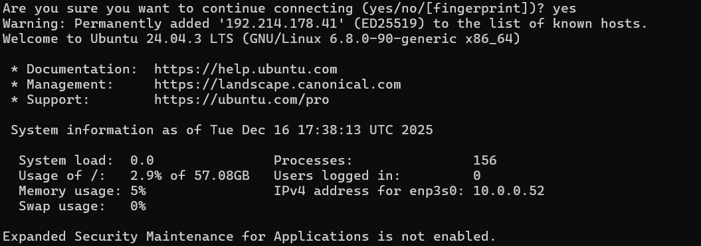
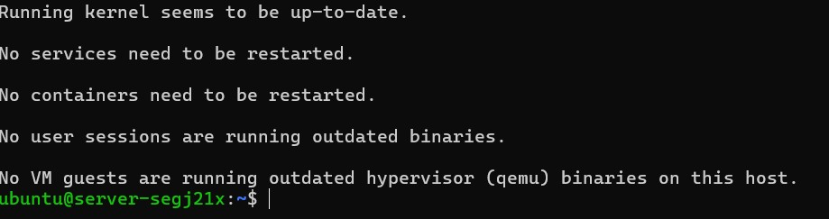
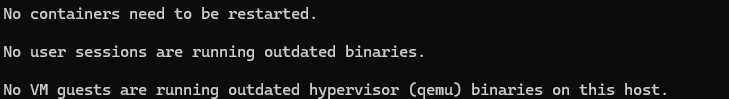
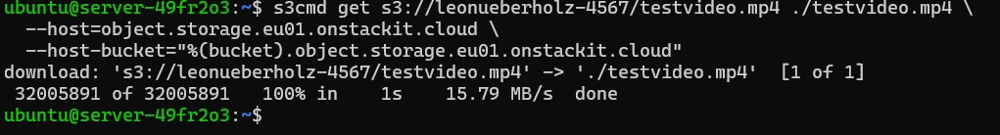
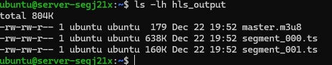
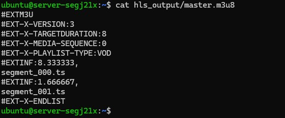
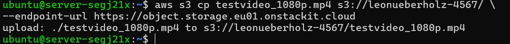

# Transcodierung der Videodatei auf einer virtuellen Maschine

## Schritt 1: Manifestdateierzeugung

Nachdem der Object Storage eingerichtet und das Testvideo erfolgreich hochgeladen wurde, erfolgt im nächsten Schritt die eigentliche Transcodierung der Videodatei. In AWS würde dieser Schritt durch einen verwalteten Dienst wie AWS Elemental MediaConvert übernommen werden. Da STACKIT aktuell keinen eigenen spezialisierten Transcoding-Dienst bereitstellt, wird dieser Arbeitsschritt in diesem Versuch bewusst auf einer virtuellen Maschine durchgeführt.

Die virtuelle Maschine übernimmt dabei die Rolle eines dedizierten Rechenknotens. Sie greift auf die im Object Storage abgelegte Quelldatei zu, verarbeitet diese lokal und speichert die erzeugten Ergebnisdateien anschließend wieder im Object Storage ab. Dieses Vorgehen entspricht einem typischen cloudbasierten Workflow, bei dem Speicher und Rechenleistung klar voneinander getrennt sind.

### Verbindung zur virtuellen Maschine

Zunächst wird eine Verbindung zur zuvor erstellten virtuellen Maschine hergestellt. Der Zugriff erfolgt über das Secure Shell Protokoll (SSH).

```bash
ssh -i <PFAD_ZUM_PRIVATE_KEY> ubuntu@<PUBLIC-IP-DER-VM>
```
<div style="
  border: 2px solid #ffffff;
  padding: 14px;
  border-radius: 6px;
  margin: 14px 0;
">
  <span style="color:cyan; font-weight:bold; font-size:1.2em;">
    Frage:
  </span><br>
  Was passiert technisch, wenn der zuvor ausgeführte Befehl eingegeben wird?<br>
  Beschreiben Sie, welche Komponenten beteiligt sind und welche Aktionen im Hintergrund ablaufen.
  Gehen Sie dabei insbesondere darauf ein, wie der Befehl mit dem Betriebssystem bzw. der Cloud-Infrastruktur interagiert.
</div>

Nach erfolgreicher Anmeldung befindet man sich auf dem Linux-System der virtuellen Maschine und kann dort weitere Software installieren und ausführen.

<div style="
  border: 2px solid #ffffff;
  padding: 14px;
  border-radius: 6px;
  margin: 14px 0;
">
  <span style="font-size:1.1em;">
    ℹ️ <strong>Hinweis:</strong>
  </span><br>
  Beim ersten Verbindungsaufbau per SSH erscheint eine Sicherheitsabfrage zum sogenannten <em>Host-Fingerprint</em>.
  Diese Abfrage dient dazu, die Identität des entfernten Servers zu überprüfen.
  Da es sich hierbei um eine neu erstellte virtuelle Maschine handelt, ist der Fingerprint dem lokalen System noch nicht bekannt.
  In diesem Fall genügt es, die Abfrage mit <code>yes</code> zu bestätigen.
  Der Fingerprint wird anschließend gespeichert, sodass diese Abfrage bei zukünftigen Verbindungen nicht erneut erscheint.
</div>

**Nach erfolgreicher Eingabe sollte folgende Ausgabe in der Powershell zu erwarten sein**



## Aktueller Stand des Versuchs

**Bis zu diesem Punkt wurden alle grundlegenden Voraussetzungen für einen cloudbasierten Transcoding-Workflow geschaffen. Die benötigte Infrastruktur ist vollständig eingerichtet und funktionsfähig.**

Zunächst wurde ein Object Storage als zentraler Speicherort für die Medieninhalte angelegt und erfolgreich getestet. Anschließend wurde eine virtuelle Maschine bereitgestellt, die als Rechenknoten für die Medienverarbeitung dient. Durch die Einrichtung von Netzwerk, Security Groups und einer öffentlichen IP-Adresse konnte der externe Zugriff auf die virtuelle Maschine ermöglicht werden.

Der erfolgreiche Verbindungsaufbau per SSH bestätigt, dass die virtuelle Maschine korrekt konfiguriert ist und aus dem Internet erreichbar ist. Damit steht nun eine lauffähige Linux-Arbeitsumgebung zur Verfügung, auf der die eigentliche Transcodierung durchgeführt werden kann.

## Ziel der nächsten Schritte

Im folgenden Abschnitt beginnt der zentrale Verarbeitungsschritt des Video-on-Demand-Workflows. Die zuvor im Object Storage abgelegte Videodatei wird auf die virtuelle Maschine übertragen und dort mithilfe einer Transcoding-Software verarbeitet.

**Konkret werden in den nächsten Schritten:**
- die Transcodierungssoftware "ffmpeg" installiert
- die benötigte Software zur Medienverarbeitung eingesetzt,
- die Quelldatei aus dem Object Storage geladen,
- eine Manifestdatei aus dem dort hinterlegten Video erzeugt
- und die transcodierten Ergebnisse wieder im Object Storage abgelegt.

Damit wird der Übergang von der reinen Infrastruktur- und Speicherbereitstellung zur eigentlichen Medienverarbeitung vollzogen, wie er auch in realen cloudbasierten Video-on-Demand-Systemen üblich ist.

### Installation der Transcoding-Software

Für die Transcodierung wird in diesem Versuch das Kommandozeilenwerkzeug **FFmpeg** eingesetzt. FFmpeg ist ein weit verbreitetes Open-Source-Werkzeug zur Verarbeitung von Audio- und Videodaten und wird sowohl in Forschung, Lehre als auch in produktiven Medien-Workflows verwendet.

Die Installation erfolgt direkt auf der virtuellen Maschine über den Paketmanager des Betriebssystems:

Bedeutet:**Geben Sie folgende Befehle in das gleiche Powershellfenster ein, wo sie die Verbindung initialisiert haben**

**Tipp:** Sie können dies kontrollieren indem vor ihrem Eingabefeld in grüner Schrift ihr Server angezeigt wird


**Geben Sie bitte nun dort folgenden Befehl ein:**

```bash
sudo apt update
```

**Geben Sie bitte danach folgendes in die Konsole ein:**


```bash
sudo apt install ffmpeg -y
```
**Nach erfolgreicher Ausführung sollten sie folgende Meldung bekommen:**



## Zugriff auf den Object Storage von der virtuellen Maschine

Nachdem die virtuelle Maschine vorbereitet und die Transcoding-Software installiert wurde, muss sie nun selbstständig auf den Object Storage zugreifen können. Dazu wird auf der VM die bereits bekannte S3-kompatible Schnittstelle verwendet. Die virtuelle Maschine übernimmt damit aktiv die Rolle des Transcoders und greift direkt auf die im Object Storage abgelegten Quelldateien zu.


### Nutzung der S3-kompatiblen Schnittstelle mit s3cmd

STACKIT stellt für den Object Storage keine eigenen, vollwertigen Client-Werkzeuge bereit, wie sie beispielsweise von großen Hyperscalern angeboten werden. Die Verwaltung des Object Storage erfolgt primär über die Weboberfläche des STACKIT Control Centers, in der grundlegende Aufgaben wie das Anlegen von Buckets oder das Erstellen von Zugangsdaten durchgeführt werden können.

Für den Datentransfer sowie für automatisierte Workflows stellt STACKIT eine **S3-kompatible Schnittstelle** bereit. Diese orientiert sich an der weit verbreiteten Amazon-S3-API, die sich als De-facto-Standard für objektbasierten Cloud-Speicher etabliert hat. Durch diesen Ansatz können etablierte, herstellerunabhängige Werkzeuge eingesetzt werden.

Im Rahmen dieses Versuchs wird ausschließlich das Open-Source-Werkzeug **s3cmd** verwendet.  
`s3cmd` dient hierbei als technischer Client zur Kommunikation mit der S3-kompatiblen Schnittstelle von STACKIT. Der Zugriff erfolgt explizit über den STACKIT-Endpoint, es wird **keine AWS-Infrastruktur** genutzt.

---

### Installation von s3cmd

Installieren Sie `s3cmd` über den Paketmanager des Betriebssystems:

```bash
sudo apt install s3cmd
```


**Folgende Ausgabe sollte daraus erfolgen:**




**Prüfen Sie die Installation bitte mit folgendem Befehl**

```bash
s3cmd --version
```

**Nun geht es an das Konfigurieren, hierfür benötigen wir den Befehl:**

```bash
s3cmd --configure
```

**Hier werden seriell der Accesskey und Secret Acceskey abgefragt, sowie Default Region Name und Default Output Format**

**Die Ausgabe sollte so aussehen:**

```bash
Enter new values or accept defaults in brackets with Enter.
Refer to user manual for detailed description of all options.

Access key and Secret key are your identifiers for Amazon S3. Leave them empty for using the env variables.
Access Key: **IHR PUBLICKEY**
Secret Key: **IHR Privatekey**
Default Region [US]: eu01

Use "s3.amazonaws.com" for S3 Endpoint and not modify it to the target Amazon S3.
S3 Endpoint [s3.amazonaws.com]: object.storage.eu01.onstackit.cloud
```


<div style="
  border: 2px solid #ffffff;
  padding: 14px;
  border-radius: 6px;
  margin: 14px 0;
">
  <span style="font-size:1.1em;">
    ℹ️ <strong>Hinweis:</strong>
  </span><br>
Die Keys, die Sie hier eingeben sollen, sind jene, die Sie zu Beginn in STACKIT angelegt haben.
Es wird vorausgesetzt, dass Sie sich diese sorgfältig notiert haben.
Falls dies nicht der Fall ist, können die Zugangsdaten jederzeit erneut erstellt werden.
Eine Anleitung dazu finden Sie im vorherigen Kapitel. 🙂
</div>


### Test des Zugriffs auf den Object Storage von StackIT

Nach der erfolgreichen Konfiguration wird überprüft, ob die virtuelle Maschine auf den Object Storage zugreifen kann. Dazu wird der zuvor erstellte Bucket aufgelistet.

**Bitte geben sie folgendne Befehl in die VM Console ein:**  

```bash
s3cmd ls s3://<DEINBUCKETNAME> \
  --host=object.storage.eu01.onstackit.cloud \
  --host-bucket="%(bucket).object.storage.eu01.onstackit.cloud"
```

## Download der Videodatei auf die virtuelle Maschine

Im nächsten Schritt wird die im Object Storage abgelegte Videodatei auf die virtuelle Maschine kopiert. Erst nachdem sich die Datei lokal auf der VM befindet, kann sie von der Transcoding-Software verarbeitet werden.

### Kopieren der Datei aus dem Object Storage

Der Download erfolgt mithilfe von s3cmd.
Die für den Zugriff auf den STACKIT Object Storage benötigten Endpoint-Parameter wurden zuvor im Rahmen der Konfiguration (s3cmd --configure) hinterlegt.
Der folgende Befehl muss direkt auf der virtuellen Maschine ausgeführt werden:

```bash
s3cmd get s3://<DEINBUCKETNAME>/testvideo.mp4 ./testvideo.mp4 \
  --host=object.storage.eu01.onstackit.cloud \
  --host-bucket="%(bucket).object.storage.eu01.onstackit.cloud"
```
**Folgendes Ergebis ist zu erwarten:**



**Auch hier gilt wieder testen:**


```bash
ls -lh testvideo.mp4
```

## Der Transcodiervorgang
Nachdem sich die Videodatei lokal auf der virtuellen Maschine befindet und vom Bucket geholt wurde, kann nun die eigentliche Transcodierung durchgeführt werden. Ziel ist es, aus der hochauflösenden Quelldatei mehrere Distributionsformate mit unterschiedlichen Auflösungen und Bitraten zu erzeugen. Diese Formate sind für verschiedene Endgeräte und Netzwerkbedingungen optimiert.

Für die Transcodierung wird das Kommandozeilenwerkzeug **FFmpeg** verwendet. FFmpeg liest die Quelldatei ein, dekodiert sie und erzeugt neue Ausgabedateien mit den vorgegebenen Parametern.


## ErTranscodierung für adaptives Streaming (HLS)

Neben der Erzeugung klassischer MP4-Distributionsdateien werden in modernen
Video-on-Demand-Systemen häufig adaptive Streaming-Formate eingesetzt.
Diese bestehen aus mehreren kurzen Videosegmenten sowie sogenannten
Manifestdateien, die Informationen über verfügbare Auflösungen, Bitraten
und Segmentabfolgen enthalten.

Im folgenden Abschnitt wird gezeigt, wie mithilfe von FFmpeg aus der
hochaufgelösten Quelldatei ein HLS-kompatibles Streaming-Format inklusive
Manifestdatei erzeugt werden kann. Diese Ausgabeform eignet sich für die
Auslieferung über ein Content Delivery Network (CDN).

### Vorbereitung des Arbeitsverzeichnisses

Zunächst wird auf der virtuellen Maschine ein separates Ausgabeverzeichnis
für die HLS-Dateien angelegt:

```bash
mkdir hls_output
```

**Erstellung der Manifest- und Segmentdateien**

Die Transcodierung erfolgt erneut mithilfe von FFmpeg. Im Gegensatz zur
klassischen MP4-Ausgabe wird hierbei das HLS-Ausgabeformat verwendet.
FFmpeg erzeugt dabei automatisch eine Manifestdatei sowie mehrere
Videosegmente.
`
**Geben Sie folgenden Command in das von ihnen gerade erstellte Konsolenverzeichnis ein:**

```bash
ffmpeg -i testvideo.mp4 \
-map 0:v -map 0:a \
-c:v libx264 -preset veryfast \
-c:a aac -b:a 128k \
-f hls \
-hls_time 4 \
-hls_playlist_type vod \
-hls_segment_filename "hls_output/segment_%03d.ts" \
hls_output/master.m3u8
```


**Sie sollten sowas in etwa sehen:**


**Danach kann geprüft werden ob die Manifestdateien wirklich angelegt worden sind:**

```bash
ls -lh hls_output
```


Anzeigen der Manifestdatei

Die Manifestdatei ist eine reine Textdatei und kann mit einfachen
Kommandozeilenwerkzeugen betrachtet werden.
Dazu wird der Inhalt der Datei master.m3u8 mit dem Befehl cat ausgegeben:


```bash
cat hls_output/master.m3u8
```


**Die Ausgabe sieht danach dann so aus:**



<div style="
  border: 2px solid #ffffff;
  padding: 14px;
  border-radius: 6px;
  margin: 14px 0;
">
  <span style="color:cyan; font-weight:bold; font-size:1.2em;">
    Aufgabe:
  </span><br>
  Analysieren Sie die Ausgabe der Datei <code>master.m3u8</code>, die mit dem
  Befehl <code>cat</code> angezeigt wurde.<br><br>

  Erläutern Sie, welche Informationen in der Manifestdatei enthalten sind und
  welche Bedeutung die einzelnen Einträge (z. B. <code>#EXT</code>-Tags und
  Segmentreferenzen) für die Wiedergabe des Videos haben.<br><br>

  Gehen Sie dabei insbesondere darauf ein, wie das Manifest den Aufbau des
  Videostreams beschreibt und warum die eigentlichen Mediendaten nicht direkt
  in der Manifestdatei enthalten sind.
</div> 


## Einspeisung der Manifest- und Segmentdateien in den STACKIT Object Storage

Nach der Untersuchung der Manifestdatei werden die erzeugten HLS-Dateien wieder
in den Object Storage übertragen.
Dazu wird das gesamte Verzeichnis hls_output in einen Unterordner des zuvor
erstellten Buckets kopiert.

Upload der HLS-Dateien

```bash
s3cmd sync hls_output/ s3://<DEINBUCKETNAME>/hls/ \
  --host=object.storage.eu01.onstackit.cloud \
  --host-bucket="%(bucket).object.storage.eu01.onstackit.cloud"
```

Dabei werden sowohl die Manifestdatei (master.m3u8) als auch alle zugehörigen
Segmentdateien (.ts) übertragen.

# Überprüfung des Uploads

Um zu prüfen, ob die Dateien erfolgreich im Object Storage abgelegt wurden,
wird der Inhalt des Zielverzeichnisses aufgelistet:

```bash
s3cmd ls s3://<DEINBUCKETNAME>/hls/ \
  --host=object.storage.eu01.onstackit.cloud \
  --host-bucket="%(bucket).object.storage.eu01.onstackit.cloud"
```

In der Ausgabe sollten nun sowohl die Manifestdatei als auch mehrere
Segmentdateien angezeigt werden.


### Übersicht der Zielparameter

In diesem Versuch werden drei Ausgabeformate erzeugt:

- Full HD (1080p) für leistungsfähige Endgeräte  
- HD (720p) für mittlere Bandbreiten  
- SD (480p) für mobile oder eingeschränkte Netzwerkbedingungen  

### Transcodierung in 1080p

Zunächst wird eine Version mit einer Auflösung von 1920×1080 Pixeln erzeugt.


**Geben Sie dafür bitte folgenden Command in die VM CLI ein:**

```bash
ffmpeg -i testvideo.mp4 \
-vf scale=1920:1080 \
-c:v libx264 -b:v 5M \
-c:a aac -b:a 192k \
testvideo_1080p.mp4
```
**Dabei werden folgende Einstellungen verwendet:**

Skalierung auf 1920×1080 Pixel

H.264-Video-Codec (libx264)

Videobitrate von 5 Mbit/s

AAC-Audio mit 192 kbit/s


**Nach Abschluss der Transcodierung kann überprüft werden, ob alle Dateien erfolgreich erstellt wurden:**

```bash
ls -lh testvideo_*.mp4
```
---


<div style="
  border: 2px solid #ffffff;
  padding: 14px;
  border-radius: 6px;
  margin: 14px 0;
">
  <span style="color:cyan; font-weight:bold; font-size:1.2em;">
    Aufgabe:
  </span><br>
  Fertigen Sie einen Screenshot der abschließenden <em>libx264</em>-Ausgabe an, die nach dem Transcodierungsvorgang in der Konsole angezeigt wird.
  Interpretieren Sie anhand dieser Ausgabe, wie der Encoder die Videodaten verarbeitet hat.
  Gehen Sie dabei insbesondere auf die Verteilung von <em>I-, P- und B-Frames</em>, die angezeigten
  <em>QP-Werte</em> sowie die resultierende durchschnittliche Bitrate ein und erläutern Sie,
  was diese Informationen über Qualität, Komplexität und Effizienz der Transcodierung aussagen.
</div>


**Wiederhholen SIe diesen Befehl bitte auch für 720p und 480p. Nehmen Sie sich den obrigen Befehl für die 1080p COdierung als Hilfe**


## Transcodierten Dateien wieder in den Bucket einfügen
Nachdem die Videodatei erfolgreich in mehrere Distributionsformate transcodiert wurde, müssen die erzeugten Ausgabedateien wieder im zentralen Cloud-Speicher abgelegt werden. Dieser Schritt ist notwendig, damit die transcodierten Inhalte unabhängig von der virtuellen Maschine verfügbar sind und in einem weiteren Schritt beispielsweise über ein Content Delivery Network (CDN) ausgeliefert oder weiterverarbeitet werden können.

Der Upload der Dateien erfolgt ausgehend von der virtuellen Maschine zurück in den STACKIT Object Storage. Damit wird der vollständige Verarbeitungszyklus eines cloudbasierten Video-on-Demand-Workflows abgeschlossen: von der Speicherung der Quelldatei über die Verarbeitung auf einer Recheninstanz bis hin zur erneuten Ablage der Ergebnisse im Objektspeicher.

**Zunächst wird geprüft, ob alle transcodierten Dateien lokal auf der virtuellen Maschine vorhanden sind:**

```bash
ls -lh testvideo_*p.mp4
```

*Es sollten alle erzeugten Versionen (z. B. 1080p, 720p, 480p) angezeigt werden.*


**Die transcodierten Dateien werden nun nacheinander in den zuvor erstellten Bucket hochgeladen:**

```bash
s3cmd put testvideo_1080p.mp4 s3://<DEINBUCKETNAME>/ \
  --host=object.storage.eu01.onstackit.cloud \
  --host-bucket="%(bucket).object.storage.eu01.onstackit.cloud"

s3cmd put testvideo_720p.mp4 s3://<DEINBUCKETNAME>/ \
  --host=object.storage.eu01.onstackit.cloud \
  --host-bucket="%(bucket).object.storage.eu01.onstackit.cloud"

s3cmd put testvideo_480p.mp4 s3://<DEINBUCKETNAME>/ \
  --host=object.storage.eu01.onstackit.cloud \
  --host-bucket="%(bucket).object.storage.eu01.onstackit.cloud"
```

<div style="
  border: 2px solid #ffffff;
  padding: 14px;
  border-radius: 6px;
  margin: 14px 0;
">
  <span style="font-size:1.1em;">
    💪 <strong>Fleißaufgabe:</strong>
  </span><br>
  Recherchieren Sie, mit welchem <em>Syntax</em> mehrere transcodierte Dateien gleichzeitig
  aus einem Verzeichnis in den Object Storage hochgeladen werden können.
  Erläutern Sie anhand des verwendeten Befehls, wie mithilfe von
  <code>--include</code> und <code>--exclude</code> gezielt nur bestimmte Dateien
  (z. B. alle transcodierten Versionen eines Videos) übertragen werden.
</div>


**Das Ergebnis sollte so aussehen:**




**Nach Abschluss des Uploads wird überprüft, ob die Dateien erfolgreich im Object Storage abgelegt wurden:**

```bash
scp ubuntu@192.214.178.41:~/transcoded_download/testvideo_1080p.mp4 "$env:USERPROFILE\Desktop\MediaInfo_<NAME>"
```


**Wiederholen Sie diesen Vorgang auch für die anderen transcodierten Videos. Tragen Sie diese Commands auch wieder in die Arbeitsmappe ein**


## Download der transcodierten Dateien und Analyse mit MediaInfo

Nach Abschluss der Transcodierung befinden sich die erzeugten Distributionsdateien im Object Storage.  
Im nächsten Schritt werden diese Dateien lokal auf den eigenen Rechner heruntergeladen, um sie anschließend mit dem Tool *MediaInfo* zu analysieren.

### Lokalen Ordner anlegen

Damit die Dateien übersichtlich abgelegt werden, wird auf dem eigenen Rechner ein neuer Ordner mit dem eigenen Namen erstellt.  
In diesem Ordner werden später sowohl die Videodateien als auch die Analyseergebnisse gespeichert.

**Legen Sie diesen Ordner bitte auf Ihren Desktop an und nennen Sie ihn Mediainfo_vornamenachname also Mediainfo_maxmustermann**

**Nach Abschluss des Uploads wird überprüft, ob die Dateien erfolgreich im Object Storage abgelegt wurden:**

```bash
scp ubuntu@192.214.178.41:~/transcoded_download/testvideo_1080p.mp4 "$env:USERPROFILE\Desktop\MediaInfo_<NAME>"
```


**Wiederholen Sie diesen Vorgang auch für die anderen transcodierten Videos. Tragen Sie diese Commands auch wieder in die Arbeitsmappe ein**


## Analyse der transcodierten Dateien mit MediaInfo

Nach dem Download aus der virtuellen Maschine liegen die transcodierten Videodateien lokal auf dem eigenen Rechner, z. B. auf dem Desktop.  
Im nächsten Schritt werden diese Dateien mit dem Analysewerkzeug *MediaInfo* untersucht.


### Vorbereitung

Zuerst muss sichergestellt werden, dass *MediaInfo* installiert ist.  
Das Programm kann von der offiziellen Webseite heruntergeladen und installiert werden.

https://mediaarea.net/de/MediaInfo/Download

---

### Analyse über die grafische Oberfläche

1. MediaInfo starten  
2. Die gewünschte Videodatei per Drag-and-Drop in das MediaInfo-Fenster ziehen  
   oder über **Datei → Öffnen** auswählen  
3. Die technischen Informationen der Datei werden automatisch angezeigt

MediaInfo zeigt unter anderem folgende Parameter an:
- Auflösung
- Video-Bitrate
- Audio-Bitrate
- Codec
- Framerate
- Containerformat


**Darunter sollten Sie jetzt Werte angezeigt bekommen wie bspw: Format, Formatprofil,...**
**Fertigen Sie bitte einen Screenshot der verschiedenen transcodierten Versionen an und betten Sie diese in ihre Abgabemappe ein**


<div style="
  border: 2px solid #ffffff;
  padding: 14px;
  border-radius: 6px;
  margin: 14px 0;
">
  <span style="color:cyan; font-weight:bold; font-size:1.2em;">
    Aufgabe:
  </span><br>
  
  **Nun ist ihre kreativität gefragt...**
  Transcodieren Sie die Datei <code>testvideo.mp4</code> erneut mit <em>FFmpeg</em> und nehmen Sie dabei eigenständig Anpassungen an den Transcodierungsparametern vor.<br><br>

  Verändern Sie mindestens zwei der folgenden Punkte:
  <ul>
    <li>Video-Bitrate</li>
    <li>Audio-Bitrate</li>
    <li>Framerate</li>
  </ul>


  Der benötigte FFmpeg-Befehl kann eigenständig aus der offiziellen Dokumentation oder durch Recherche im Internet ermittelt werden.<br><br>

  Analysieren Sie die erzeugte Ausgabedatei anschließend mit <em>MediaInfo</em> und dokumentieren Sie:
  <ul>
    <li>die gewählten Parameter</li>
    <li>den verwendeten FFmpeg-Befehl</li>
    <li>die Unterschiede zur vorherigen Transcodierung</li>
  </ul>
</div>


---


