# Service-Konfiguration in Fastly

In diesem Versuch wird auf den transcodierten Videodateien aus Versuch 1 aufgebaut.  
Ziel ist es, diese Dateien nicht mehr direkt aus dem STACKIT Object Storage abzurufen, sondern über ein Content Delivery Network (CDN) bereitzustellen.

Als CDN-Anbieter wird **Fastly** verwendet.

---
**Doch was genau bringt uns das eigentlich und wofür machen wir das ganze hier. Mit einer Grafik wird versucht zu erklären was die klaren Vorteile hierbei sind**

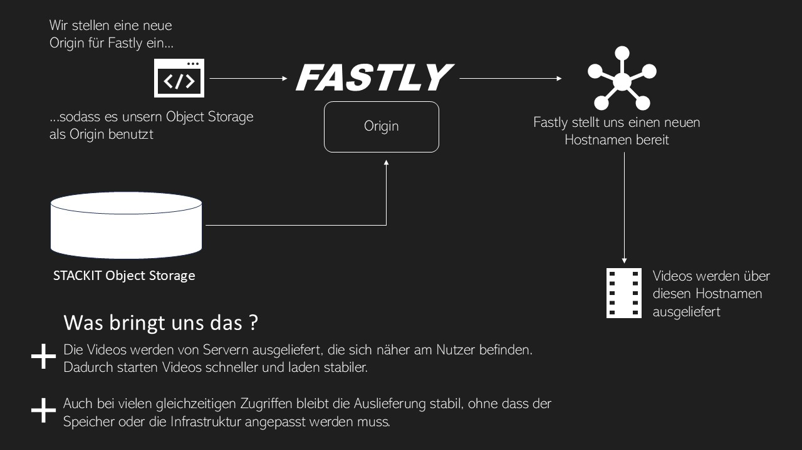

**Verstanden? Dann kann es nun losgehen! Wir gehen das wieder Schritt für Schritt durch!**

## Schritt 1: Ausgangslage

Die transcodierten Videodateien liegen im STACKIT Object Storage und sind dort als einzelne Dateien gespeichert, z. B.:

- `testvideo_1080p.mp4`
- `testvideo_720p.mp4`
- `testvideo_480p.mp4`


**Prüfen sie das bitte noch mal. Verbinden Sie sich wieder zu erst mit Ihrer VM auf den Server:**


```bash
ssh@ubuntu<DEINESERVERIP>
```

**Sie kommen wieder auf die folgende Maske:**

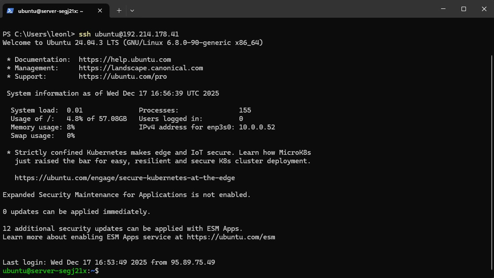


**Nun prüfen ob die Videos draufliegen:**

```bash
aws s3 ls s3://<DEINBUCKETNAME>/ \
--endpoint-url https://object.storage.eu01.onstackit.cloud
```

Der Object Storage übernimmt die Rolle des **Origin Servers**.

**Soweit ist alles vorbereitet für unsere Koppelung an das CDN. im nächsten Schritt wird die Bedienung für Fastly erklärt**

# Fastly: Erste Schritte

**Um Fastly nutzen zu können brauchen Sie einen dementsprechenden Account**
#
#
#
#
#       *leave blank for further instructions*
#
#
#
#

**Navigieren Sie bitte zur Internetseite von Fastly https://www.fastly.com/ und melden Sie sich dort mit ihren Credentials an:** 

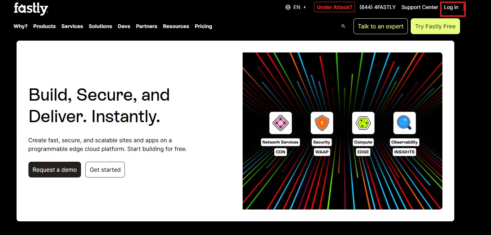

*leave blank for further instructions*

**Sie sollten nun die folgende Fastly Startseite vor sich sehen.**

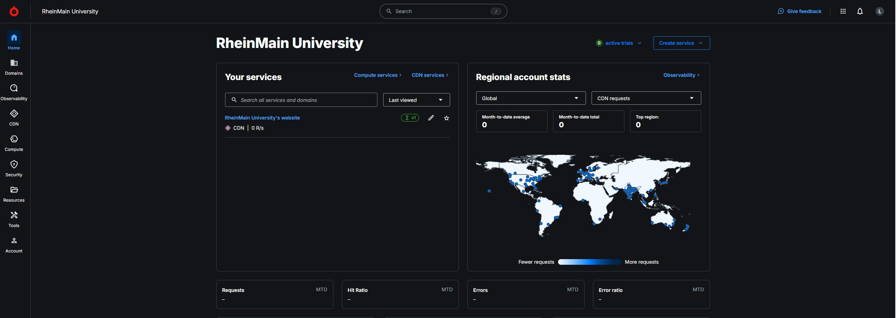

## Schritt 1: Neuen Fastly Service erstellen

Nach dem Login befindet man sich im Fastly-Dashboard des Kurses.  
Da für diesen Versuch noch kein CDN-Service existiert, muss zunächst ein neuer Service angelegt werden.

---


### 1. Service-Erstellung starten

Im oberen rechten Bereich des Dashboards wird der Button **Create service** ausgewählt.

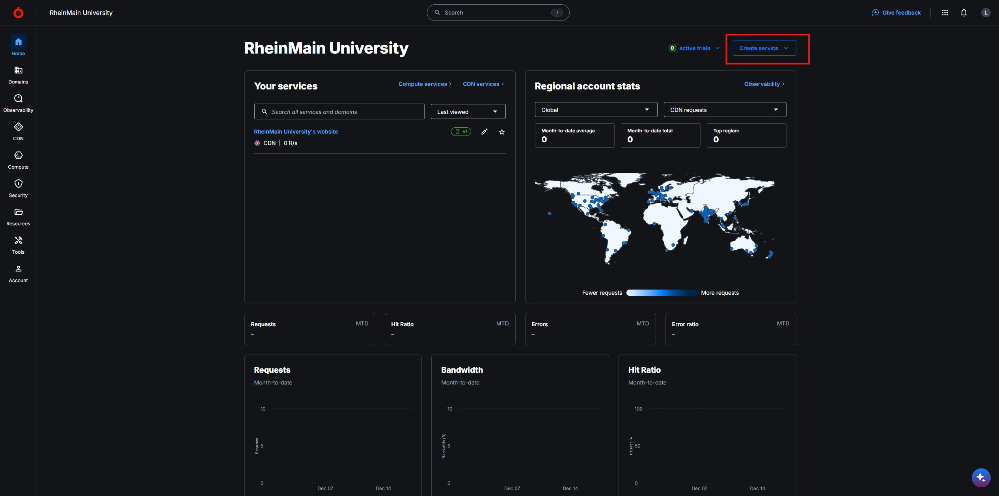

**Wählen Sie dort bitte CDN**

**Folgende Maske sollte nun erscheinen:**

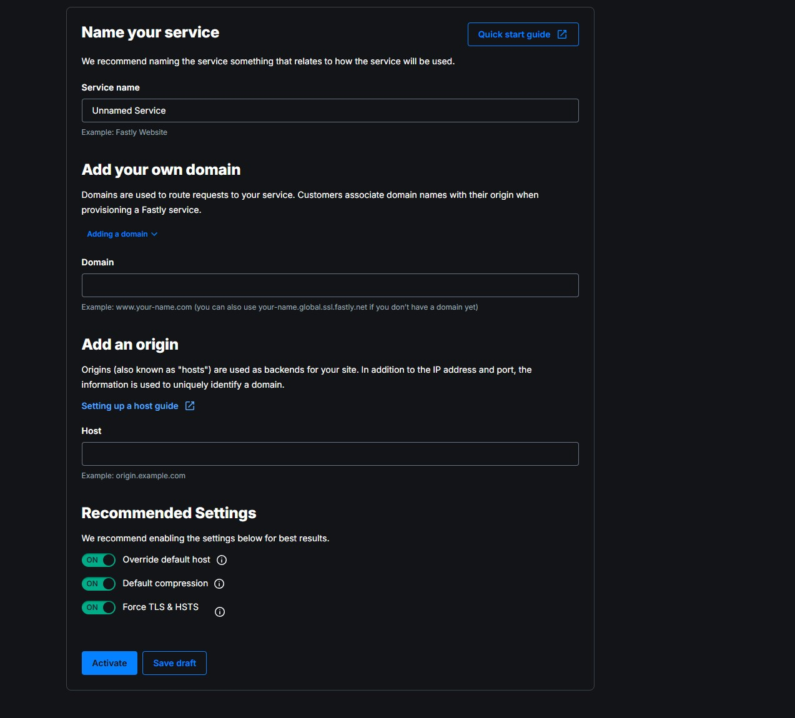

**Tätigen Sie dort bitte folgende Einstellungen:**

| Feld / Bereich        | Eingabe                               |
|----------------------|----------------------------------------|
| Service name         | `vod-versuch2-<namenachname>`          |
| Eigene Domain        | `<namenachname>.global.ssl.fastly.net` |
| Origin Host          | `https://<Virtual-Hosted-Style-Name>.object.storage.eu01.onstackit.cloud`|
| Override default host| aktiviert                              |
| Default compression  | aktiviert                              |
| Force TLS & HSTS  | aktiviert                                 |

**Danach auf Aktivieren klicken**                           

**So sollte es nun bei Ihnene aussehen:**

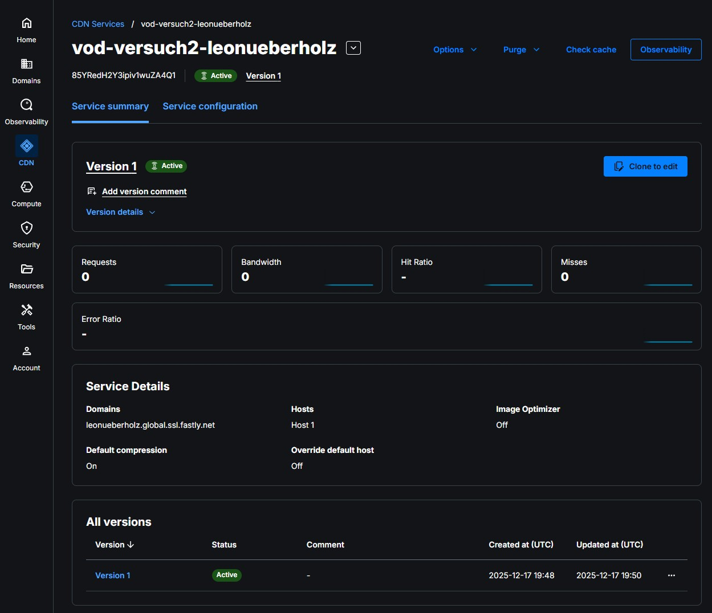


**Es wurde nun eine eigene Domain in ihrem Namen angelegt mit dem Syntax: <namenachname>.global.ssl.fastly.net**


**Gehen Sie nun in den Browser und geben Sie dort folgendes ein:**

```bash
https://<namenachname>.global.ssl.fastly.net/<deinBucketname>/testvideo_1080p.mp4
```

<div style="
  border: 2px solid #ffffff;
  padding: 14px;
  border-radius: 6px;
  margin: 14px 0;
">
  <span style="color:cyan; font-weight:bold; font-size:1.2em;">
    Aufgabe:
  </span><br>
 Was sehen Sie? Fertigen Sie hierfür bitte einen Screenshot an und tragen Sie diesen in ihre Abgabemappe ein.
 Interpretieren Sie die angegebene Nachricht 
</div>

**Das Problem lässt sich lösen indem wir nun in StackIt weiter machen:**


### 2. Zugriffsrechte erstellen:

**Stack It erlaubt es anders als AWS nicht die Zugriffsrechte auf der Website UI anzupassen. Hierfür müssen wir der VM die Rechte händisch mitgeben. Das klingt komplizierter als es eigentlich ist. In ein paar Schritten ist dies getan**


**Verbinden sie sich mit der VM von StackIT**

```bash
ssh ubuntu@<IP-DEINER-VM>
```
**Sie müssten sich hier wieder finden.**

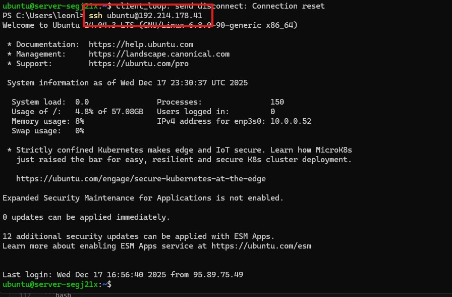

**Nun wird die Datei angelegt die uns die BErechtigung geben soll. Geben Sie hierfür folgendes ein.**

```bash
nano public-read.json
```
**Die Maske der Powershell sollte nun so aussehen:**

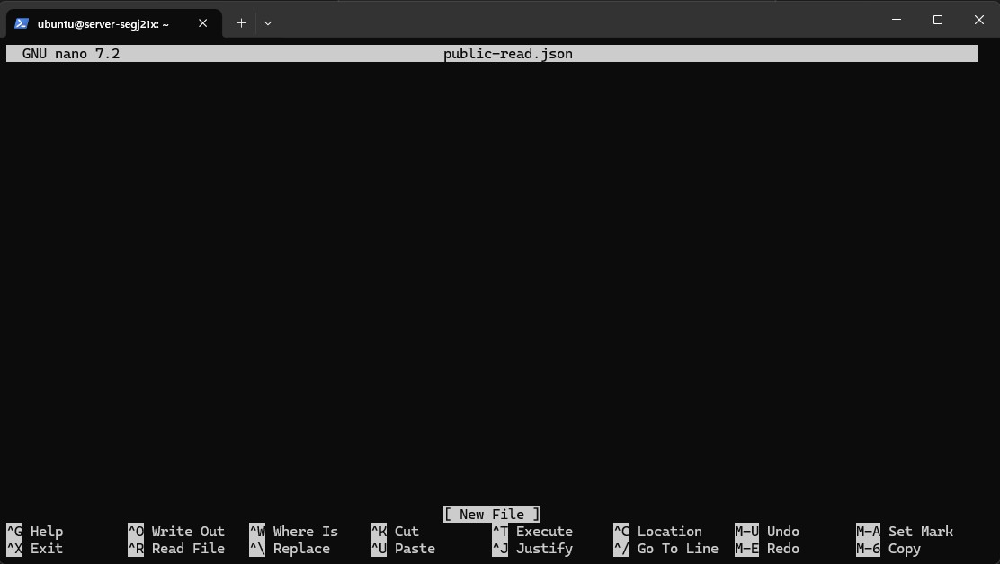

**Geben Sie nun folgenden Befehl dort ein:**

```bash
{
  "Version": "2012-10-17",
  "Statement": [
    {
      "Effect": "Allow",
      "Principal": "*",
      "Action": "s3:GetObject",
      "Resource": "arn:aws:s3:::<DeinBucketname>/*"
    }
  ]
}
```

**Klicken Sie nun CTRL+O für das Speichern.**

**Danach ENTER**

**Danach CTRL+X für das schließen**

**Sie befinden sich wieder auf der Hauptmaske**

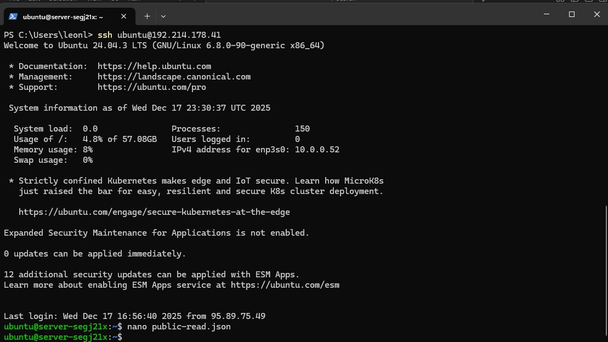

---
**Nun wird die Policy angewandt**


```bash
aws s3api put-bucket-policy \
  --bucket <DeinBucketname> \
  --policy file://public-read.json \
  --endpoint-url https://object.storage.eu01.onstackit.cloud
```


***Navigieren Sie bitte jetzt zu dem Internetbrowser firefox und geben sie in die URL folgendes ein:**

```bash
https://<namenachname>.global.ssl.fastly.net/testvideo_1080p.mp4
```

**Wichtig ist hierbei das sie den Browser Firefox benutzen. Chrome unterstützt dieses Feature nicht**

**Sie sollten folgende Ausgabe im Browser erhalten:**

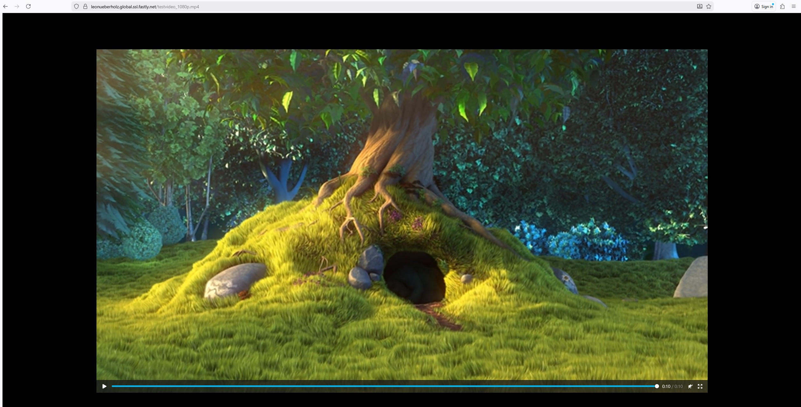

**Jetzt interessiert uns noch von wo diese Ablieferung stattfindet. Hierfür erinnern wir uns wieder an das Modul CM1 bei dem wir verschiedene Tools kenennlernern durften um eine Hostdadresse genauer zu inspizieren**

<div style="
  border: 2px solid #ffffff;
  padding: 14px;
  border-radius: 6px;
  margin: 14px 0;
">
  <span style="color:cyan; font-weight:bold; font-size:1.2em;">
    Frage:
  </span><br>
  Mit welchem Kommandozeilenbefehl können Sie überprüfen, auf welche IP-Adressen der CDN-Hostname aufgelöst wird und welcher Edge-Server für die Auslieferung der Inhalte verwendet wird? Fertigen Sie hierzu einen Screenshot der Ausgabe an.
  
</div>

**Tipp:**

```bash
 _______ Fastly-Url 1.1.1.1
 ```
<div style="
  border: 2px solid #ffffff;
  padding: 14px;
  border-radius: 6px;
  margin: 14px 0;
">
  <span style="color:cyan; font-weight:bold; font-size:1.2em;">
    Info:
  </span><br>
  Bei DNS-Abfragen kann es sinnvoll sein, einen öffentlichen DNS-Resolver wie
  <code>1.1.1.1</code> (Cloudflare) anzugeben, da lokale Router oder
  Provider-DNS bei CDN-Hostnamen zu Timeouts oder unerwarteten Ergebnissen
  führen können.
</div>


