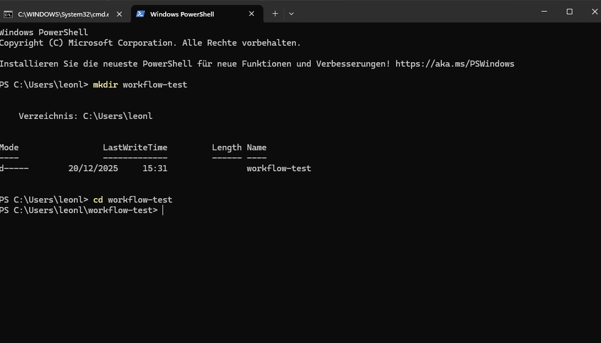
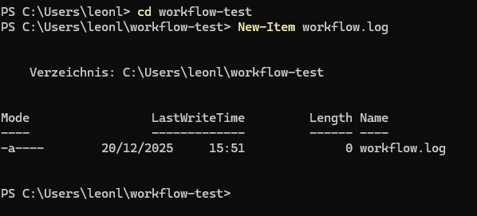
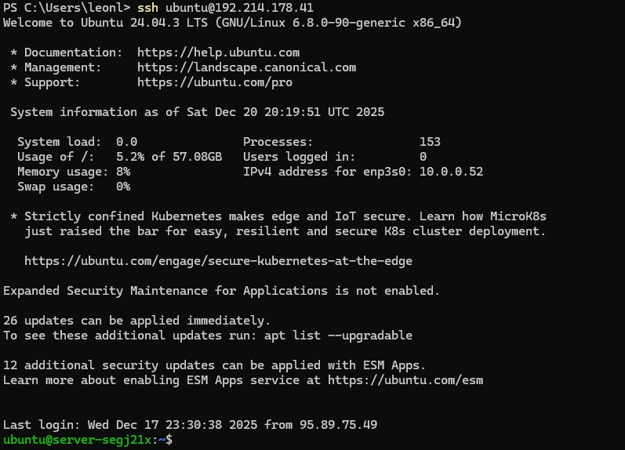
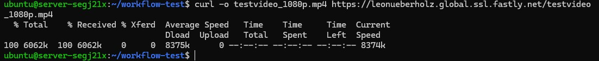
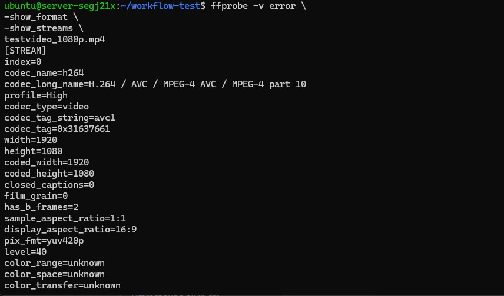

# Mini-Test: Ingest → Analyse → CDN-Abruf

## Kurzbriefing

Sie bauen in diesem Versuch einen kleinen, selbstgeschriebenen Workflow.
Dieser überprüft automatisch, ob ein Video korrekt über ein CDN ausgeliefert wird und dokumentiert die wichtigsten technischen Informationen in einer Logdatei.

### Voraussetzungen

-Eine transcodierte Videodatei liegt im STACKIT Object Storage
(z. B. testvideo_1080p.mp4)

-Die Datei ist über Fastly erreichbar
(z. B. https://<username>.global.ssl.fastly.net/testvideo_1080p.mp4)

-Zugriff auf: eine Linux-VM oder ein lokales System mit curl und ffmpeg/ffprobe

## Ablaufplan zu dem Versuch 

Die folgenden Schritte können entweder  
    **lokal in der Windows PowerShell** oder  
    **auf der Linux-VM** durchgeführt werden.

    Für diesen Versuch wird empfohlen, die Schritte **lokal auszuführen**,  
    da kein Zugriff auf die VM erforderlich ist und alle benötigten Werkzeuge
    (curl, ffprobe) lokal verfügbar sind.

**Öffnen Sie Windows PowwerShell (lokal)**
**Geben Sie folgendes in die PowerShell ein:**


```bash
mkdir workflow-test
cd workflow-test
```

**Dies sollte nun folgendermaßen ausshen:**



**Nun erstellen wir ein neues Item. Dieses nennen wir Workflow.log und wird folgendermaßen angelegt:**

```bash
New-Item workflow.log
```




**Geben Sie den folgenden Befehl ein:**

```bash
$URL = "https://<DeineDomain>.global.ssl.fastly.net/testvideo_1080p.mp4"
```


**Mit diesem Befehl wurde eine Variable in der PowerShell angelegt. Statt die vollständige URL bei jedem weiteren Befehl erneut eingeben zu müssen, kann sie nun wiederverwendet werden.**


**Nächster Schritt: CDN-Antwort abrufen**
Ziel dieses Schritts:

-prüfen ob die Datei erreichabr ist

-sehen, welches System antwortet (CDN)

-noch keine Datei herunterladen

**Schritt 2: Header der CDN-Antowrt anzeigen**

**Führe jetzt genau diesen Befehl aus:**

```bash
curl.exe -I $URL
```

**Sie sollten jetzt eine Auflistung sehen:**
**Tragen Sie die Sachen in eine Tabelle ein und betten Sie diesen :**

| HTTP-Header / Feld           | Bedeutung / Beobachtung (ausfüllen) |
|-----------------------------|-------------------------------------|
| HTTP/1.1 200 OK             |                                     |
| Connection                  |                                     |
| Content-Length              |                                     |
| Content-Type                |                                     |
| Server                      |                                     |
| x-amz-request-id            |                                     |
| x-amz-id-2                  |                                     |
| x-ntap-sg-trace-id          |                                     |
| ETag                        |                                     |
| x-amz-server-side-encryption|                                     |
| Last-Modified               |                                     |
| Accept-Ranges               |                                     |
| Age                         |                                     |
| Date                        |                                     |
| Via                         |                                     |
| X-Served-By                 |                                     |
| X-Cache                     |                                     |
| X-Cache-Hits                |                                     |
| X-Timer                     |                                     |
| Strict-Transport-Security   |                                     |


**Nächster Schritt: Videodatei auf der VirutalMachien inspizieren**

**Schritt 1: Verbinden Sie sich bitte wieder mit der VM**

```bash
ssh @Ubuntu<IpdesServers>
```



**Erstellen Sie hier bitte ein neues Verzeichnis:**

```bash
mkdir ~/workflow-test
cd ~/workflow-test
```

**Laden Sie sich bitte in dieses Verzeichnis die transcodierten Videodateien herunter:**

```bash
curl -o testvideo_1080p.mp4 https://<DeinDomainname>.global.ssl.fastly.net/testvideo_1080p.mp4
curl -o testvideo_720p.mp4 https://<DeinDomainname>.global.ssl.fastly.net/testvideo_720p.mp4
curl -o testvideo_460p.mp4 https://<DeinDomainname>.global.ssl.fastly.net/testvideo_460p.mp4
```
**Sie sollten folgenden Auswurf bekommen:**




 **Nun ünerprüfen ob die Videodatei abgelegt sind:**

**Als nächsten beschäftigen wir uns mit der ANalyse. Geben sie hierfür folgenden Command ein:**

```bash
ffprobe -v error \
-show_format \
-show_streams \
testvideo_1080p.mp4
```

**Dies sieht dann so aus:**


**Kopieren SIe sich die Ausgabe in ein separates Textdokument**

**Das gleiche bitte auch für die 720p Variante:**
```bash
ffprobe -v error `
-show_format `
-show_streams `
testvideo_720p.mp4
```

**Kopieren SIe sich die Ausgabe in ein separates Textdokument**

**Das gleiche bitte auch für die 460p Variante:**
```bash
ffprobe -v error `
-show_format `
-show_streams `
testvideo_460p.mp4
```
**Kopieren SIe sich die Ausgabe in ein separates Textdokument**

<div style="
  border: 2px solid #ffffff;
  padding: 14px;
  border-radius: 6px;
  margin: 14px 0;
">
  <span style="color:cyan; font-weight:bold; font-size:1.2em;">
    Aufgabe: Vergleich der Transcoding-Ergebnisse
  </span><br><br>

  Analysieren Sie die Ausgaben von <code>ffprobe</code> für die folgenden Dateien:
  <ul>
    <li><code>testvideo_1080p.mp4</code></li>
    <li><code>testvideo_720p.mp4</code></li>
    <li><code>testvideo_460p.mp4</code></li>
  </ul>

  Gehen Sie dabei insbesondere auf folgende Punkte ein:
  <ul>
    <li>Welche technischen Parameter unterscheiden sich zwischen den Dateien?</li>
    <li>Welche Parameter sind bei allen Versionen identisch?</li>
    <li>Wie verändert sich die Bitrate im Verhältnis zur Auflösung?</li>
    <li>Welche Auswirkungen haben diese Unterschiede auf Bandbreite und Speicherbedarf?</li>
  </ul>

  <b>Hinweis:</b><br>
  Nutzen Sie ausschließlich die mit <code>ffprobe</code> ermittelten Werte.
  Eigene Annahmen ohne Messwerte sind kenntlich zu machen.
</div>


Kontrollieren Sie, dass die Datei in das richtige Verzeichnis kopiert wurde.
